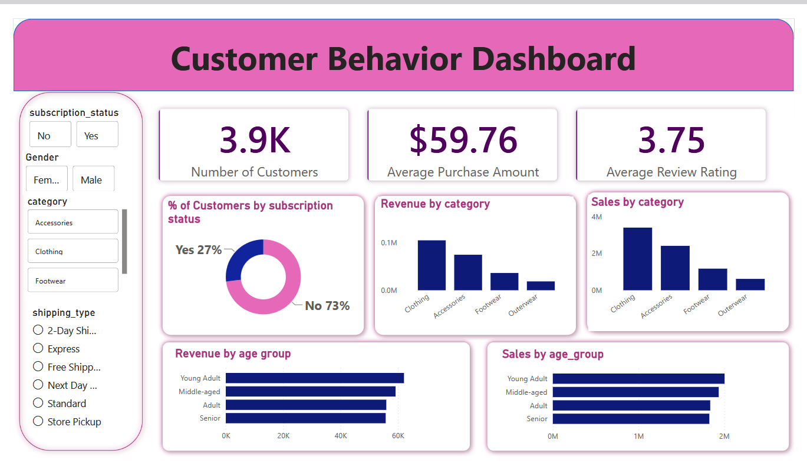

# Customer Behavior Analysis using Python, PostgreSQL & Power BI

## Overview

This project analyzes customer behavior and churn patterns using Python, PostgreSQL, and Power BI. The objective is to identify customer trends, understand churn behavior, and generate actionable business insights.

## Business Problem

Customer churn significantly affects business growth and profitability. Understanding customer behavior helps organizations improve customer retention and optimize business strategies.

## Tools & Technologies

- Python
- Pandas
- NumPy
- PostgreSQL
- SQLAlchemy
- Power BI
- Matplotlib
- Seaborn

## Project Workflow

1. Data Collection
2. Data Cleaning & Preprocessing
3. PostgreSQL Database Integration
4. SQL-Based Analysis
5. Exploratory Data Analysis (EDA)
6. Dashboard Development
7. Business Insights Generation

## SQL Analysis

Performed SQL queries to:

- Calculate churn rates
- Analyze customer demographics
- Segment customer groups
- Generate business KPIs
- Identify churn patterns

## Dashboard Features

- Total Customers
- Churn Rate
- Customer Segmentation
- Revenue Analysis
- Contract Type Analysis
- Gender Distribution
- Customer Retention Insights

## Key Insights

- Customers with month-to-month contracts showed higher churn.
- Long-tenure customers had better retention rates.
- Certain customer segments were more likely to churn.
- Customer demographics influenced retention behavior.

## Files Included

- app.py
- sql_queries.sql
- customer_churn_data.csv
- customer_behavior_dashboard.pbix
- Dashboard.png

## Skills Demonstrated

### Technical Skills

- Python Programming
- SQL Querying
- PostgreSQL
- Data Cleaning
- Exploratory Data Analysis
- Dashboard Development

### Analytical Skills

- Customer Churn Analysis
- Customer Segmentation
- KPI Analysis
- Business Intelligence
- Data-Driven Decision Making

## Dashboard Preview

## Author

Thaniska B
Aspiring Data Analyst | Python | SQL | Power BI | PostgreSQL
